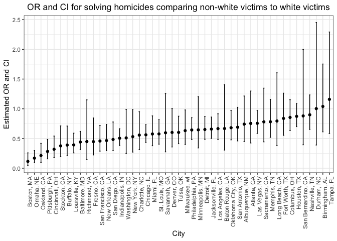
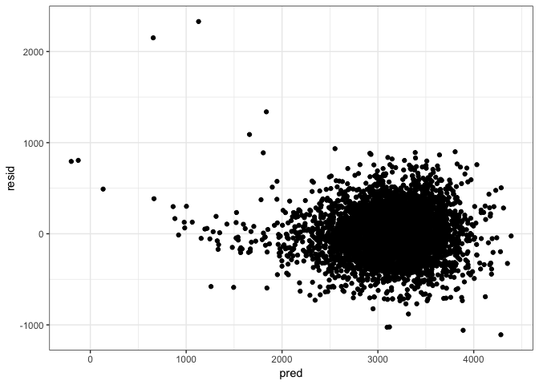

p8105\_hw6\_kz2334
================
Kangkang Zhang

Load required packages.

Problem 1
---------

Import the data.

``` r
homicide_data = read_csv("./data/homicide-data.csv")
```

Create a city\_state variable, and a binary variable indicating whether the homicide is solved.

``` r
homicide_data = homicide_data %>% 
  mutate(city_state = str_c(city, ", ", state),
         status = ifelse(disposition %in% c("Closed without arrest", "Open/No arrest"), 0, 1))
```

Omit cities Dallas, TX; Phoenix, AZ; Kansas City, MO and Tulsa, AL. Modifiy victim\_race to have categories white and non-white, with white as the reference category. Convert victim\_age to numeric.

``` r
homicide_md = homicide_data %>% 
  filter(!(city_state %in% c("Dallas, TX", "Phoenix, AZ", "Kansas City, MO", "Tulsa, AL"))) %>% 
  mutate(victim_race = ifelse(victim_race == "White", "white", "non-white"),
         victim_race = as.factor(victim_race), 
         victim_race = relevel(victim_race, ref = "white"),
          victim_age = as.numeric(victim_age))
```

------------------------------------------------------------------------

Run logistic regression for the city of Baltimore, MD. Find out the CI and estimate of the adjusted odds ratio for solving homicides comparing non-white victims to white victims keeping all other variables fixed.

``` r
balt_logistic = homicide_md %>% 
  filter(city_state == "Baltimore, MD") %>% 
  glm(status ~ victim_age + victim_sex + victim_race, data = ., family = binomial())

balt_logistic %>% 
  broom::tidy() %>%
  #extract OR and CIs for OR
  mutate(OR = exp(estimate),
    conf_low_or = exp(confint(balt_logistic, level = 0.95)[,1]),
    conf_high_or = exp(confint(balt_logistic, level = 0.95)[,2])) %>% 
  filter(term == "victim_racenon-white") %>% 
  select(., OR, starts_with("conf")) %>% 
  knitr::kable(digit = 3)
```

|     OR|  conf\_low\_or|  conf\_high\_or|
|------:|--------------:|---------------:|
|  0.441|          0.312|            0.62|

We can see that adjusted OR for solving homicides comparing non-white victims to white victims in Baltimore is 0.441. 95% CI is (0.312, 0.620). The OR solving homicides for non-white victims is 0.441 times of that for white victims, which means non-white victims are less likely to be with solving homicides.

------------------------------------------------------------------------

Run glm for each of the cities, and extract the adjusted odds ratio (and CI) for solving homicides comparing non-white victims to white victims. Create a dataframe with estimated ORs and CIs for each city.

``` r
homicide_city = homicide_md %>% 
  group_by(city_state) %>% 
  nest() %>%
  #run glm, extract estimates and CIs
  mutate(logistic = map(data, ~glm(status ~ victim_age + victim_sex + victim_race, 
                                   data = .x, family = binomial())),
         result = map(logistic, broom::tidy),
         conf = map(logistic, confint), 
         result_comb = map2(result, conf, cbind)) %>%
  select(city_state, result_comb) %>% 
  unnest() %>%
  filter(term == "victim_racenon-white") %>%
  janitor::clean_names() %>%
  #calculate OR and CIs
  mutate(OR = exp(estimate),
    conf_low_or = exp(x2_5_percent),
    conf_high_or = exp(x97_5_percent)) %>% 
  select(city_state, OR, starts_with("conf")) 

homicide_city %>% 
  knitr::kable(digit = 3)
```

| city\_state        |     OR|  conf\_low\_or|  conf\_high\_or|
|:-------------------|------:|--------------:|---------------:|
| Albuquerque, NM    |  0.741|          0.449|           1.215|
| Atlanta, GA        |  0.753|          0.424|           1.299|
| Baltimore, MD      |  0.441|          0.312|           0.620|
| Baton Rouge, LA    |  0.668|          0.304|           1.405|
| Birmingham, AL     |  1.039|          0.612|           1.754|
| Boston, MA         |  0.115|          0.043|           0.259|
| Buffalo, NY        |  0.390|          0.210|           0.710|
| Charlotte, NC      |  0.558|          0.313|           0.951|
| Chicago, IL        |  0.562|          0.432|           0.734|
| Cincinnati, OH     |  0.318|          0.180|           0.541|
| Columbus, OH       |  0.855|          0.634|           1.153|
| Denver, CO         |  0.602|          0.358|           1.008|
| Detroit, MI        |  0.651|          0.487|           0.869|
| Durham, NC         |  1.003|          0.390|           2.452|
| Fort Worth, TX     |  0.838|          0.553|           1.264|
| Fresno, CA         |  0.448|          0.222|           0.846|
| Houston, TX        |  0.873|          0.698|           1.090|
| Indianapolis, IN   |  0.505|          0.381|           0.665|
| Jacksonville, FL   |  0.658|          0.502|           0.862|
| Las Vegas, NV      |  0.755|          0.586|           0.972|
| Long Beach, CA     |  0.794|          0.379|           1.606|
| Los Angeles, CA    |  0.666|          0.481|           0.916|
| Louisville, KY     |  0.392|          0.257|           0.590|
| Memphis, TN        |  0.782|          0.519|           1.160|
| Miami, FL          |  0.576|          0.377|           0.881|
| Milwaukee, wI      |  0.632|          0.398|           0.982|
| Minneapolis, MN    |  0.646|          0.341|           1.204|
| Nashville, TN      |  0.899|          0.652|           1.234|
| New Orleans, LA    |  0.466|          0.294|           0.737|
| New York, NY       |  0.531|          0.271|           0.988|
| Oakland, CA        |  0.213|          0.099|           0.418|
| Oklahoma City, OK  |  0.681|          0.477|           0.970|
| Omaha, NE          |  0.169|          0.091|           0.298|
| Philadelphia, PA   |  0.644|          0.485|           0.850|
| Pittsburgh, PA     |  0.282|          0.157|           0.485|
| Richmond, VA       |  0.447|          0.144|           1.150|
| San Antonio, TX    |  0.689|          0.459|           1.026|
| Sacramento, CA     |  0.781|          0.443|           1.348|
| Savannah, GA       |  0.596|          0.275|           1.258|
| San Bernardino, CA |  0.880|          0.394|           1.999|
| San Diego, CA      |  0.483|          0.294|           0.778|
| San Francisco, CA  |  0.458|          0.288|           0.719|
| St. Louis, MO      |  0.577|          0.405|           0.819|
| Stockton, CA       |  0.376|          0.193|           0.713|
| Tampa, FL          |  1.159|          0.585|           2.293|
| Tulsa, OK          |  0.602|          0.411|           0.876|
| Washington, DC     |  0.510|          0.250|           0.989|

------------------------------------------------------------------------

Create a plot that shows the estimated ORs and CIs for each city. Organize cities according to estimated OR.

``` r
homicide_city %>%
  mutate( city_state = fct_reorder(city_state, OR)) %>% 
  ggplot(aes(x = city_state, y = OR)) +
  geom_point() +
  geom_errorbar(aes(ymin = conf_low_or, ymax = conf_high_or), width = 0.2) +
  theme(axis.text.x = element_text(angle = 90, hjust = 1)) +
  labs(
    title = "OR and CI for solving homicides comparing non-white victims to white victims",
    x = "City",
    y = "Estimated OR and CI"
  ) 
```



According to the plot, most of the cities have ORs less than 1, which means in those cities, non-white victims are less likely to be with solving homicides. Boston has the smallest value of OR, closing to zero. Tampa has the largest value of OR, slightly larger than 1.

Problem 2
---------

Load and clean the data for regression analysis.

``` r
birth_data = read_csv("./data/birthweight.csv")

birth_data = birth_data %>%
  #convert categorical variables to factor
  mutate( babysex = as.factor(babysex),
          frace = as.factor(frace),
          malform = as.factor(malform),
          mrace = as.factor(mrace)
          )

#check NA values
birth_data %>% 
  summarise_all(funs(sum(is.na(.)))) %>% 
  knitr::kable()
```

|  babysex|  bhead|  blength|  bwt|  delwt|  fincome|  frace|  gaweeks|  malform|  menarche|  mheight|  momage|  mrace|  parity|  pnumlbw|  pnumsga|  ppbmi|  ppwt|  smoken|  wtgain|
|--------:|------:|--------:|----:|------:|--------:|------:|--------:|--------:|---------:|--------:|-------:|------:|-------:|--------:|--------:|------:|-----:|-------:|-------:|
|        0|      0|        0|    0|      0|        0|      0|        0|        0|         0|        0|       0|      0|       0|        0|        0|      0|     0|       0|       0|

``` r
#check zero-equal values
birth_data %>% 
  summarise_all(funs(sum(. == 0))) %>% 
  knitr::kable()
```

|  babysex|  bhead|  blength|  bwt|  delwt|  fincome|  frace|  gaweeks|  malform|  menarche|  mheight|  momage|  mrace|  parity|  pnumlbw|  pnumsga|  ppbmi|  ppwt|  smoken|  wtgain|
|--------:|------:|--------:|----:|------:|--------:|------:|--------:|--------:|---------:|--------:|-------:|------:|-------:|--------:|--------:|------:|-----:|-------:|-------:|
|        0|      0|        0|    0|      0|        1|      0|        0|     4327|         1|        0|       0|      0|    4339|     4342|     4342|      0|     0|    2552|      19|

Follow the dictionary of the dataset, I convert 4 variables to factor. Then I find out there is no NA value in each variable. Then I check if there are zero values. I find that there is one missing value in family income and one missing value in mother’s age at menarche. Luckily this is a small number.

#### build my own model

------------------------------------------------------------------------

Check corrolations between variables.

``` r
#omit observations have missing values
birth_data = birth_data%>% 
  filter(menarche != 0 & fincome != 0)

#check corrolation
birth_data %>% 
  select_if(is.numeric) %>%
  select(bwt, everything()) %>% 
  cor() %>% 
  knitr::kable(digits = 3)
```

|          |     bwt|   bhead|  blength|   delwt|  fincome|  gaweeks|  menarche|  mheight|  momage|  parity|  pnumlbw|  pnumsga|   ppbmi|    ppwt|  smoken|  wtgain|
|----------|-------:|-------:|--------:|-------:|--------:|--------:|---------:|--------:|-------:|-------:|--------:|--------:|-------:|-------:|-------:|-------:|
| bwt      |   1.000|   0.747|    0.743|   0.288|    0.154|    0.412|    -0.027|    0.193|   0.135|  -0.008|       NA|       NA|   0.094|   0.183|  -0.075|   0.247|
| bhead    |   0.747|   1.000|    0.630|   0.214|    0.116|    0.378|    -0.004|    0.117|   0.108|  -0.020|       NA|       NA|   0.087|   0.137|  -0.054|   0.183|
| blength  |   0.743|   0.630|    1.000|   0.229|    0.078|    0.359|    -0.024|    0.161|   0.080|  -0.032|       NA|       NA|   0.074|   0.149|  -0.066|   0.191|
| delwt    |   0.288|   0.214|    0.229|   1.000|    0.035|    0.124|    -0.087|    0.412|   0.074|  -0.005|       NA|       NA|   0.720|   0.871|   0.048|   0.425|
| fincome  |   0.154|   0.116|    0.078|   0.035|    1.000|    0.106|    -0.005|    0.131|   0.323|  -0.026|       NA|       NA|  -0.020|   0.048|   0.079|  -0.016|
| gaweeks  |   0.412|   0.378|    0.359|   0.124|    0.106|    1.000|    -0.004|    0.063|   0.113|  -0.080|       NA|       NA|   0.027|   0.057|   0.036|   0.148|
| menarche |  -0.027|  -0.004|   -0.024|  -0.087|   -0.005|   -0.004|     1.000|    0.078|   0.174|   0.020|       NA|       NA|  -0.125|  -0.071|   0.016|  -0.045|
| mheight  |   0.193|   0.117|    0.161|   0.412|    0.131|    0.063|     0.078|    1.000|   0.110|  -0.013|       NA|       NA|  -0.100|   0.427|   0.061|   0.049|
| momage   |   0.135|   0.108|    0.080|   0.074|    0.323|    0.113|     0.174|    0.110|   1.000|   0.052|       NA|       NA|   0.081|   0.130|   0.075|  -0.089|
| parity   |  -0.008|  -0.020|   -0.032|  -0.005|   -0.026|   -0.080|     0.020|   -0.013|   0.052|   1.000|       NA|       NA|  -0.006|  -0.011|  -0.006|   0.011|
| pnumlbw  |      NA|      NA|       NA|      NA|       NA|       NA|        NA|       NA|      NA|      NA|        1|       NA|      NA|      NA|      NA|      NA|
| pnumsga  |      NA|      NA|       NA|      NA|       NA|       NA|        NA|       NA|      NA|      NA|       NA|        1|      NA|      NA|      NA|      NA|
| ppbmi    |   0.094|   0.087|    0.074|   0.720|   -0.020|    0.027|    -0.125|   -0.100|   0.081|  -0.006|       NA|       NA|   1.000|   0.853|   0.006|  -0.110|
| ppwt     |   0.183|   0.137|    0.149|   0.871|    0.048|    0.057|    -0.071|    0.427|   0.130|  -0.011|       NA|       NA|   0.853|   1.000|   0.038|  -0.075|
| smoken   |  -0.075|  -0.054|   -0.066|   0.048|    0.079|    0.036|     0.016|    0.061|   0.075|  -0.006|       NA|       NA|   0.006|   0.038|   1.000|   0.027|
| wtgain   |   0.247|   0.183|    0.191|   0.425|   -0.016|    0.148|    -0.045|    0.049|  -0.089|   0.011|       NA|       NA|  -0.110|  -0.075|   0.027|   1.000|

We can find that variables pnumsga and pnumlbw have NA value of corrolation of any other variables because the values of them equals to zero in all observartions. So we can exclude them from the model. The corrolation of responce and parity is -0.008, the closet to zero. So I decide to exclude it.

------------------------------------------------------------------------

Use VIF to select variables untill all preditors have VIF less than 10.

``` r
#delete varibles mentioned above
birth_select1 = birth_data %>% 
  select_if(is.numeric) %>%
  select(bwt, everything(), - pnumsga, - pnumlbw, - parity) 

#use vif to select variables
model1 = lm(bwt ~., birth_select1)  
model1
```

    ## 
    ## Call:
    ## lm(formula = bwt ~ ., data = birth_select1)
    ## 
    ## Coefficients:
    ## (Intercept)        bhead      blength        delwt      fincome  
    ##  -6646.6113     132.5497      77.2264       3.9864       0.9872  
    ##     gaweeks     menarche      mheight       momage        ppbmi  
    ##     12.9868      -6.0650      10.6820       4.6922       3.1399  
    ##        ppwt       smoken       wtgain  
    ##     -3.4867      -2.8719           NA

``` r
#delete NA variable wtgain

birth_select2 = birth_select1 %>% 
  select(-wtgain)

model2 = lm(bwt ~., birth_select2)  
HH::vif(model2) 
```

    ##      bhead    blength      delwt    fincome    gaweeks   menarche 
    ##   1.768175   1.754346   4.475383   1.151180   1.222987   1.064628 
    ##    mheight     momage      ppbmi       ppwt     smoken 
    ##  43.480276   1.200512 130.587266 161.500476   1.026005

``` r
#delete ppwt with largest vif

birth_select3 = birth_select2 %>% 
  select(-ppwt)

model3 = lm(bwt ~., birth_select3)  
HH::vif(model3) 
```

    ##    bhead  blength    delwt  fincome  gaweeks menarche  mheight   momage 
    ## 1.766151 1.754014 4.375940 1.150566 1.222953 1.064190 2.066712 1.200246 
    ##    ppbmi   smoken 
    ## 3.578028 1.025992

Now we can see that all variables left in the model have vif less than 10, we conclude that there is no multicollinearity among them.

------------------------------------------------------------------------

Then we use AIC criterion for var selection then keep variables with p-value &lt; 0.05.

``` r
birth_select = birth_data %>%
  select(- pnumsga, - pnumlbw, - parity, - wtgain, - ppwt) 

#use backward method for AIC criterion
reg1 = lm(bwt ~., birth_select) 
reg2 = step(reg1, direction='backward')  
```

    ## Start:  AIC=48696.98
    ## bwt ~ babysex + bhead + blength + delwt + fincome + frace + gaweeks + 
    ##     malform + menarche + mheight + momage + mrace + ppbmi + smoken
    ## 
    ##            Df Sum of Sq       RSS   AIC
    ## - frace     4    127711 321116227 48691
    ## - malform   1      1053 320989569 48695
    ## - momage    1     45577 321034094 48696
    ## - menarche  1    134703 321123219 48697
    ## <none>                  320988517 48697
    ## - fincome   1    165303 321153819 48697
    ## - mheight   1    195878 321184395 48698
    ## - mrace     3    879600 321868117 48703
    ## - babysex   1    903665 321892181 48707
    ## - ppbmi     1   2873295 323861811 48734
    ## - gaweeks   1   4376427 325364944 48754
    ## - smoken    1   5037994 326026510 48763
    ## - delwt     1   7991583 328980100 48802
    ## - blength   1 101849921 422838438 49891
    ## - bhead     1 107275328 428263845 49946
    ## 
    ## Step:  AIC=48690.71
    ## bwt ~ babysex + bhead + blength + delwt + fincome + gaweeks + 
    ##     malform + menarche + mheight + momage + mrace + ppbmi + smoken
    ## 
    ##            Df Sum of Sq       RSS   AIC
    ## - malform   1      1076 321117304 48689
    ## - momage    1     45153 321161380 48689
    ## - menarche  1    139314 321255542 48691
    ## <none>                  321116227 48691
    ## - fincome   1    166145 321282372 48691
    ## - mheight   1    190981 321307209 48691
    ## - babysex   1    901960 322018188 48701
    ## - ppbmi     1   2872753 323988980 48727
    ## - gaweeks   1   4389476 325505704 48748
    ## - smoken    1   4996623 326112850 48756
    ## - delwt     1   7992218 329108446 48795
    ## - mrace     3  13584781 334701008 48865
    ## - blength   1 101791661 422907888 49884
    ## - bhead     1 107411450 428527677 49941
    ## 
    ## Step:  AIC=48688.72
    ## bwt ~ babysex + bhead + blength + delwt + fincome + gaweeks + 
    ##     menarche + mheight + momage + mrace + ppbmi + smoken
    ## 
    ##            Df Sum of Sq       RSS   AIC
    ## - momage    1     45460 321162764 48687
    ## - menarche  1    139622 321256925 48689
    ## <none>                  321117304 48689
    ## - fincome   1    165655 321282959 48689
    ## - mheight   1    192084 321309388 48689
    ## - babysex   1    901233 322018537 48699
    ## - ppbmi     1   2878769 323996073 48725
    ## - gaweeks   1   4388530 325505834 48746
    ## - smoken    1   4995993 326113296 48754
    ## - delwt     1   8007632 329124936 48794
    ## - mrace     3  13597013 334714317 48863
    ## - blength   1 101806846 422924150 49882
    ## - bhead     1 107422738 428540042 49939
    ## 
    ## Step:  AIC=48687.34
    ## bwt ~ babysex + bhead + blength + delwt + fincome + gaweeks + 
    ##     menarche + mheight + mrace + ppbmi + smoken
    ## 
    ##            Df Sum of Sq       RSS   AIC
    ## - menarche  1    115271 321278036 48687
    ## <none>                  321162764 48687
    ## - mheight   1    174384 321337148 48688
    ## - fincome   1    214964 321377728 48688
    ## - babysex   1    890669 322053433 48697
    ## - ppbmi     1   2835521 323998285 48723
    ## - gaweeks   1   4443924 325606689 48745
    ## - smoken    1   5003023 326165787 48752
    ## - delwt     1   7962611 329125375 48792
    ## - mrace     3  14792495 335955260 48877
    ## - blength   1 101765725 422928489 49880
    ## - bhead     1 107477717 428640481 49938
    ## 
    ## Step:  AIC=48686.9
    ## bwt ~ babysex + bhead + blength + delwt + fincome + gaweeks + 
    ##     mheight + mrace + ppbmi + smoken
    ## 
    ##           Df Sum of Sq       RSS   AIC
    ## <none>                 321278036 48687
    ## - mheight  1    204622 321482658 48688
    ## - fincome  1    220410 321498446 48688
    ## - babysex  1    894235 322172271 48697
    ## - ppbmi    1   2823444 324101480 48723
    ## - gaweeks  1   4435142 325713178 48744
    ## - smoken   1   5032429 326310465 48752
    ## - delwt    1   8102277 329380313 48793
    ## - mrace    3  14813023 336091059 48877
    ## - blength  1 102018289 423296325 49882
    ## - bhead    1 107376434 428654470 49936

``` r
summary(reg2)
```

    ## 
    ## Call:
    ## lm(formula = bwt ~ babysex + bhead + blength + delwt + fincome + 
    ##     gaweeks + mheight + mrace + ppbmi + smoken, data = birth_select)
    ## 
    ## Residuals:
    ##      Min       1Q   Median       3Q      Max 
    ## -1090.73  -184.82    -3.86   174.66  2349.43 
    ## 
    ## Coefficients:
    ##               Estimate Std. Error t value Pr(>|t|)    
    ## (Intercept) -5436.7038   173.2580 -31.379  < 2e-16 ***
    ## babysex2       29.3546     8.4586   3.470 0.000525 ***
    ## bhead         131.1130     3.4478  38.028  < 2e-16 ***
    ## blength        74.8843     2.0202  37.067  < 2e-16 ***
    ## delwt           4.0513     0.3878  10.446  < 2e-16 ***
    ## fincome         0.3014     0.1749   1.723 0.084972 .  
    ## gaweeks        11.2753     1.4589   7.729 1.34e-14 ***
    ## mheight        -3.7226     2.2424  -1.660 0.096971 .  
    ## mrace2       -139.3511     9.9147 -14.055  < 2e-16 ***
    ## mrace3        -77.2066    42.3510  -1.823 0.068370 .  
    ## mrace4       -102.5201    19.3324  -5.303 1.20e-07 ***
    ## ppbmi         -15.0244     2.4364  -6.167 7.62e-10 ***
    ## smoken         -4.8257     0.5862  -8.233 2.40e-16 ***
    ## ---
    ## Signif. codes:  0 '***' 0.001 '**' 0.01 '*' 0.05 '.' 0.1 ' ' 1
    ## 
    ## Residual standard error: 272.5 on 4327 degrees of freedom
    ## Multiple R-squared:  0.7176, Adjusted R-squared:  0.7169 
    ## F-statistic: 916.5 on 12 and 4327 DF,  p-value: < 2.2e-16

``` r
#remove mheight since its p-value is the largest and > 0.05
reg3 = update(reg2, . ~ . - mheight) 
summary(reg3)
```

    ## 
    ## Call:
    ## lm(formula = bwt ~ babysex + bhead + blength + delwt + fincome + 
    ##     gaweeks + mrace + ppbmi + smoken, data = birth_select)
    ## 
    ## Residuals:
    ##      Min       1Q   Median       3Q      Max 
    ## -1100.99  -183.75    -4.97   175.10  2341.81 
    ## 
    ## Coefficients:
    ##               Estimate Std. Error t value Pr(>|t|)    
    ## (Intercept) -5670.0142   101.3437 -55.948  < 2e-16 ***
    ## babysex2       28.9148     8.4562   3.419 0.000633 ***
    ## bhead         131.2551     3.4474  38.074  < 2e-16 ***
    ## blength        74.8182     2.0202  37.034  < 2e-16 ***
    ## delwt           3.6136     0.2845  12.702  < 2e-16 ***
    ## fincome         0.2750     0.1742   1.578 0.114611    
    ## gaweeks        11.4329     1.4561   7.852 5.13e-15 ***
    ## mrace2       -138.8259     9.9117 -14.006  < 2e-16 ***
    ## mrace3        -74.7144    42.3330  -1.765 0.077648 .  
    ## mrace4        -97.8502    19.1305  -5.115 3.28e-07 ***
    ## ppbmi         -12.5282     1.9175  -6.534 7.16e-11 ***
    ## smoken         -4.8313     0.5863  -8.241 2.25e-16 ***
    ## ---
    ## Signif. codes:  0 '***' 0.001 '**' 0.01 '*' 0.05 '.' 0.1 ' ' 1
    ## 
    ## Residual standard error: 272.5 on 4328 degrees of freedom
    ## Multiple R-squared:  0.7175, Adjusted R-squared:  0.7167 
    ## F-statistic: 999.1 on 11 and 4328 DF,  p-value: < 2.2e-16

``` r
#remove fincome since its p-value is the largest and > 0.05
reg4 = update(reg3, . ~ . - fincome) 
summary(reg4) %>% 
  broom::tidy() %>% 
  knitr::kable(digits = 3)
```

| term        |   estimate|  std.error|  statistic|  p.value|
|:------------|----------:|----------:|----------:|--------:|
| (Intercept) |  -5658.504|    101.098|    -55.970|    0.000|
| babysex2    |     28.794|      8.457|      3.405|    0.001|
| bhead       |    131.455|      3.446|     38.151|    0.000|
| blength     |     74.691|      2.019|     36.994|    0.000|
| delwt       |      3.630|      0.284|     12.766|    0.000|
| gaweeks     |     11.497|      1.456|      7.897|    0.000|
| mrace2      |   -144.612|      9.210|    -15.701|    0.000|
| mrace3      |    -77.594|     42.301|     -1.834|    0.067|
| mrace4      |   -102.876|     18.867|     -5.453|    0.000|
| ppbmi       |    -12.606|      1.917|     -6.575|    0.000|
| smoken      |     -4.856|      0.586|     -8.285|    0.000|

``` r
summary(reg4) %>% 
  broom::glance() %>% 
  knitr::kable(digits = 3)
```

|       |  r.squared|  adj.r.squared|   sigma|  statistic|  p.value|   df|
|-------|----------:|--------------:|-------:|----------:|--------:|----:|
| value |      0.717|          0.717|  272.59|   1098.414|        0|   11|

The factor mrace variable has four categories. Only one category has p-value &gt; 0.05, and close to 0.05. I decide to keep this variable.

Then we have a regression model for birthweight, with 2 factor predictors and 6 numeric predictors.The adjusted *R*<sup>2</sup> is 0.717, which means the model is comparatively good. The F statistics in global test is 1098.414, p-value is 0. The model is significant.

------------------------------------------------------------------------

``` r
birth_select %>% 
  modelr::add_predictions(reg4) %>% 
  modelr::add_residuals(reg4) %>% 
  ggplot(aes(x = pred, y = resid)) + geom_point()
```


